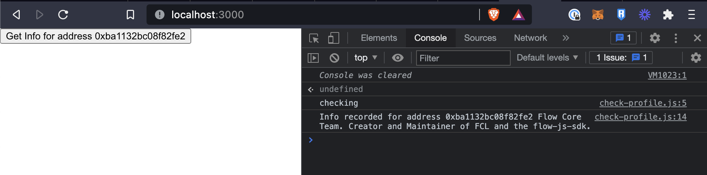
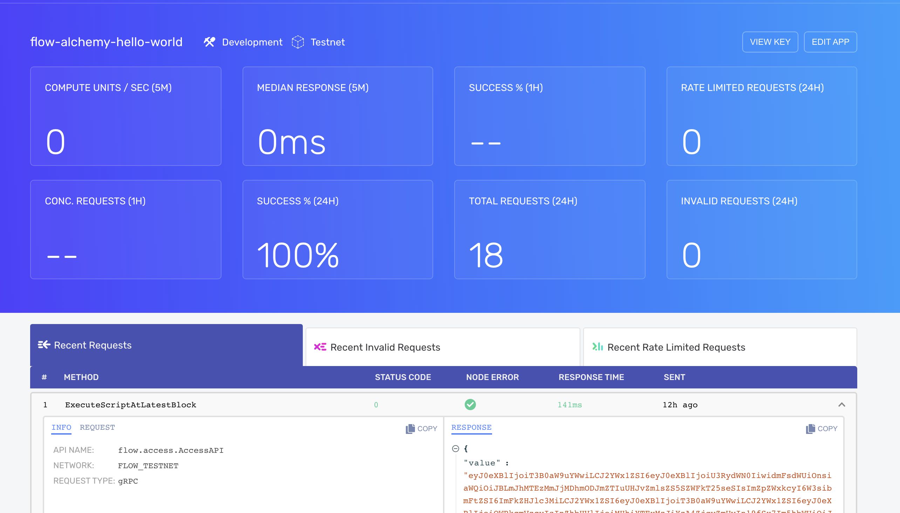
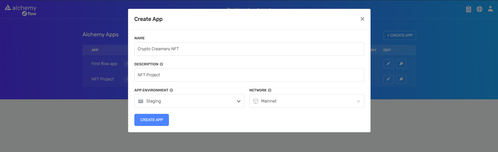
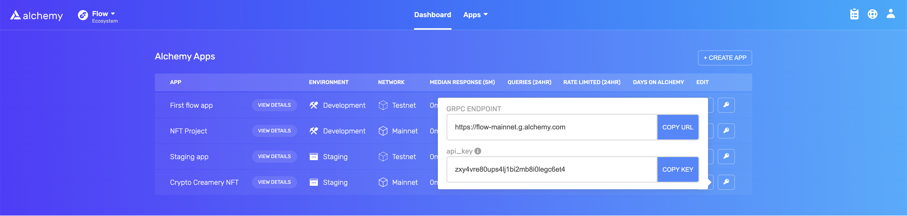
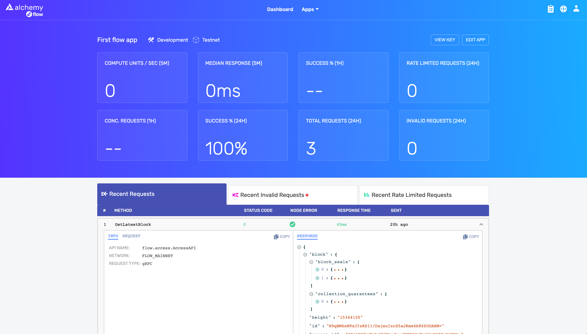

# Hello World with the Flow Javascript SDK and Alchemy

This is a simple project to show you how to configure your Flow JS SDK project
to have metrics and api calls tracked on the Alchemy dashboard.

[Flow](https://www.onflow.org/) is a new blockchain built for the next generation
of apps, games, and digital assets.

[Alchemy](https://www.alchemy.com/) is a developer platform that makes blockchain
development easier, with tools for deploying, building, monitoring, and alerting
on all your dapps.

By the end of this guide you'll have a simple React app that is configured
to send events to an Alchemy dashboard, that looks like this:

 

## 🪚 Pre-requesites 

This guide assumes that you have:
- [An Alchemy Flow account](https://www.alchemy.com/), and
- [Access to the Alchemy Flow Dashboard](https://flow-dashboard.alchemyapi.io/)

## 🧠 Overview

1. 🔑 Create an Alchemy Flow App
2. 🎸 Start a React app and configure the Flow Javascript SDK
3. ✍ Make requests

## 🔑 Create an Alchemy Flow App

To use Alchemy's products and connect to the Flow chain, you need an API key to authenticate your requests.

You can create API keys directly from the Alchemy Flow dashboard. To make a new key, click on the "Create App" button circled below:


Fill in the details under "Create App" to get your new key. There are two options for networks: Mainnet and Testnet (the API methods for both are the same), but they each have different gRPC endpoints:

- Mainnet: https://flow-mainnet.g.alchemy.com
- Testnet: https://flow-testnet.g.alchemy.com



At anytime, you can visit your dashboard homepage and view your app's keys by clicking the key icon on the far right. To make requests to flow via gRPC, you'll need both the gRPC endpoint and your unique api_key. 



By clicking the ‘View Details’ button, you can also see additional information, including your keys and recent requests.



## 🎸 Start a React app and configure the Flow Javascript SDK

1. Create a new project and Install the Flow SDK

Run the following commands on your command line to initialize a new FCL project. 

```bash
yarn create react-app flow-alchemy-hello-world
cd flow-alchemy-hello-world
yarn add @onflow/fcl @onflow/types
```

In this example, we used yarn to install @onflow/fclbut you can also use NPM.
- @onflow/fcl is the latest build of FCL, the [Flow Client Library](https://docs.onflow.org/fcl/).
- @onflow/types is a conversion layer between JavaScript and Cadence (Flow's native language). These are used when we want to pass JavaScript into Cadence transactions and scripts.

2. Configure your app + Alchemy access node

Generally it's a good idea to use environment variables for your configuration. This will allow us to change environments easily and Create React App comes with fairly good support for them out of the box. We will then need to pass these environment variables to FCL before it talks to anything else. To achieve this we will create two files (`./.env.local`, `./src/config.js`) one to hold our env. variables locally, one to import those env. variables and supply them to FCL. Then we will import our FCL configuration as the very first thing in our application.

From your command line, create these two files:

```bash
touch .env.local        # Create a .env.local file to store our environment variables
touch ./src/config.js   # Create a ./src/config.js file where we will import our environment variables and configure FCL
```

Now that we have our files we should add in our environment variables and configure your Alchemy access node. 
- `REACT_APP_ACCESS_NODE` is your gRPC Endpoint in your Alchemy dashboard

Open `.env.local` and add the following to it:

```
# File: .env.local

# REACT_APP_ACCESS_NODE will be the Alchemy endpoint for our application
# REACT_APP_ALCHEMY_API_KEY is your unique Alchemy API key.
REACT_APP_ACCESS_NODE= https://flow-testnet.g.alchemy.com
REACT_APP_ALCHEMY_API_KEY= "your-api-key"

# WALLET_DISCOVERY will be the endpoint our application
# will use to discover available FCL compatible wallets.
REACT_APP_WALLET_DISCOVERY= https://fcl-discovery.onflow.org/testnet/authn

# CONTRACT_PROFILE will be the address that has the Profile
# smart contract we will be using in this guide.
REACT_APP_CONTRACT_PROFILE= 0xba1132bc08f82fe2
```

These environment variables should now be available for us to use when we configure FCL, which we will do next. 

Open ./src/config.js and add the following to it:

```javascript
// File: ./src/config.js
import * as fcl from "@onflow/fcl"

fcl.config()
  .put("grpc.metadata", {"api_key": process.env.REACT_APP_ALCHEMY_API_KEY})
  .put("accessNode.api", process.env.REACT_APP_ACCESS_NODE) // Configure FCL's Alchemy Access Node
  .put("challenge.handshake", process.env.REACT_APP_WALLET_DISCOVERY) // Configure FCL's Wallet Discovery mechanism
  .put("0xProfile", process.env.REACT_APP_CONTRACT_PROFILE) // Will let us use `0xProfile` in our Cadence
```

Import the `config.js` file in your `index.js`:

We now have a file that configures FCL but... it is not yet being invoked, so FCL still remains un-configured in our application. The final step of this section is to import this file as the first thing in our application. Open `./src/index.js` and add the following as the first line:

```javascript
// File: ./src/index.js

import "./config" // Imports environment variables and configures FCL
// Then the rest of ./src/index.js
import React from "react"
import ReactDOM from "react-dom"
```

Congrats!! You have configured FCL, which is the very first step in having a decentralized application built on Flow 🎉.

And now, for the final step to tie it all together...

## ✍ Make requests

Now that we have FCL configured and ready to go, let's use one of the SDK functions to run a script against the Flow testnet
and see that action tracked successfully on the Alchemy dashboard.

Create a new foder to hold your Flow scripts and write your first script:

```bash
mkdir ./src/scripts
touch ./src/scripts/check-profile.js
```

Inside `./src/scripts/check-profile.js`, copy this code:

```javascript
// ./src/scripts/check-profile.js

import * as fcl from "@onflow/fcl"
import * as t from "@onflow/types"

export const checkProfile = async () => {
  const result = await fcl.query({
    cadence: `
      import Profile from 0xba1132bc08f82fe2

      pub fun main(address: Address): Profile.ReadOnly? {
        return Profile.read(address)
      }
    `,
    args: (arg, t) => [
      arg("0xba1132bc08f82fe2", t.Address)
    ],
  })
  
  console.log(result.info)
}
```

This function `checkProfile` uses the `fcl.query` function to execute a script to read the information
stored at a specific address: `0xba1132bc08f82fe2`, and then prints the `info` field recorded on the blockchain.
We'll call this function from our app homepage by hooking it up to a button.

In `./src/App.js`, we'll simplify the app to show just a button that runs the `checkProfile` function.

```javascript
// ./src/App.js
import React from "react"
import {checkProfile} from "./scripts/check-profile"

export default function App() {
  return (
    <div>
      <button onClick={checkProfile}>Get Info for address 0xba1132bc08f82fe2</button>
    </div>
  )
}
```

Save these files.

Now, load up the app in local development via:

```bash
npm start
```

After you click the button, you should be able to refresh your Alchemy dashboard and see requests being logged!

Congrats 🎉 you've successfully tracked your first Flow blockchain event on the Alchemy dashboard :)
